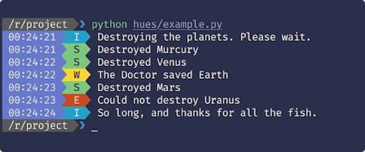
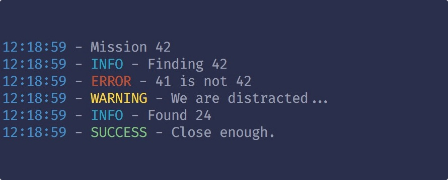
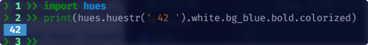

# Hues

This is the 90s and your terminal can display _16_ glorious colors.
Your Python scripts deserve the same color love. `Hues` makes printing
to console in color easy. Just grab the package from `PIP`, and your
monochromatic days will be a thing of past!




[](https://travis-ci.org/prashnts/hues) [](https://codeclimate.com/github/prashnts/hues) [](https://pypi.python.org/pypi/hues)

## Quickstart

Go, grab the latest version from PIP. Run:

```bash
pip install hues
```

Then, in your scripts, you can do this:

```python
>>> import hues
>>> hues.log('Mission', 42)
>>> hues.info('Finding', 42)
>>> hues.error(41, 'is not', 42)
>>> hues.warn('We are distracted...')
>>> hues.info('Found', 24)
>>> hues.success('Close enough.')
```




_whoa!_

### Configuration

You can add a `.hues.yml` file in your projects, or your home directory,
overriding the defaults. The configuration files are searched and loaded
in this order:

- Packaged configuration
- User home directory
- Current directory and all the parent directories

Check out the default configuration [here](hues/.hues.yml).
Currently there's a `powerline` theme shipped with the package which
you can enable by updating `theme` value in configuration.


## Creating your own prompts

`hues` makes it easy to create your own custom prompt formats with a
Hue String. Hue string is a thin wrapper around Python strings adding
a chainable syntax that's a joy to use!

```python
>>> import hues
>>> print(hues.huestr(' 42 ').white.bg_blue.bold.colorized)
```

It does exactly what it says:



The Hue string chained attributes use a deterministic pushdown automata
for optimizing the attribute access, so the ANSI escaped strings are
always optimal.


## Colors

All 16 glorious ANSI colors are available for both background and foreground. Assorted text styles such as **`bold`**, _`italics`_ and <u>`underline`</u> are also available. Too many colors? Worry not fam, go to town with `reset` attribute.


## Todo
- [ ] More Documentation.
- [ ] Unicorns required.

Please contribute by opening issues, suggestions and patches.

If you like `hues` or use it in your project, I'd love to hear about it!
Shout at me on [tumblr](//doom.noop.pw) or send me an email.


> Back in my days, we didn't even have colors!
